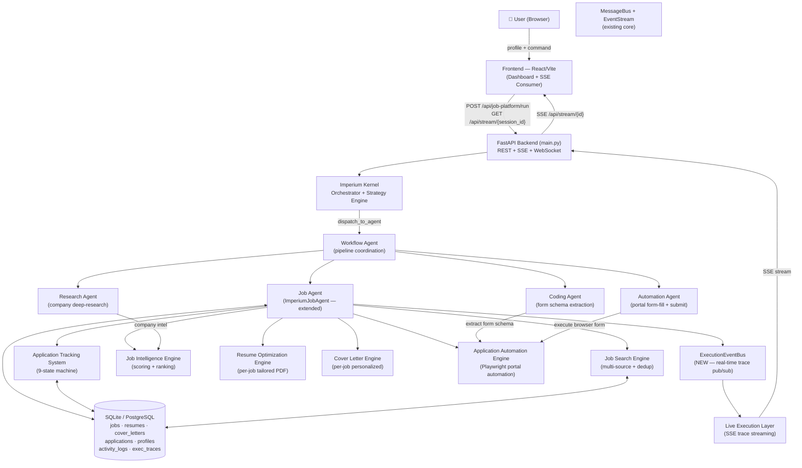
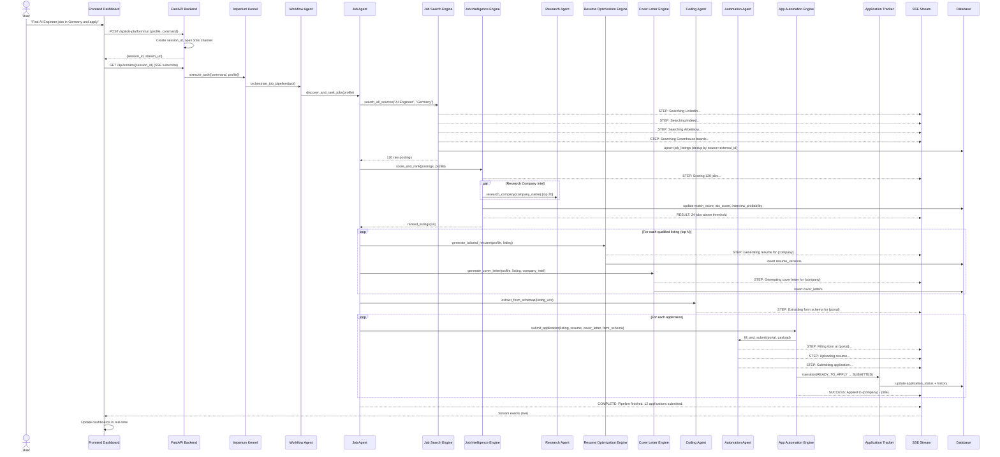
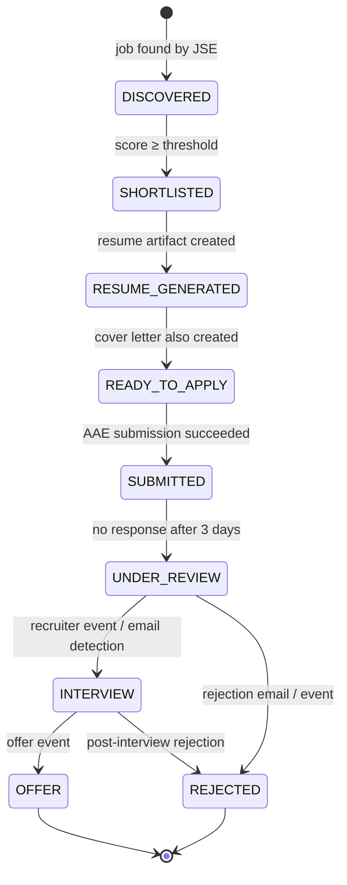
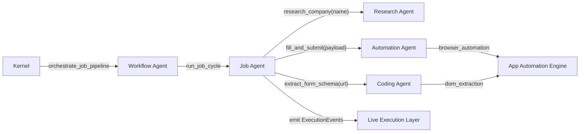
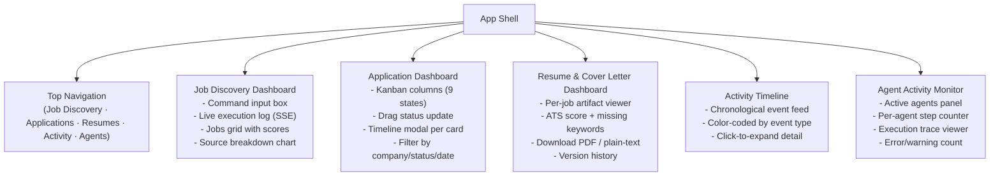

# Design Document: Imperium Job Platform

## Overview

Imperium Job Platform transforms the existing Imperium autonomous agent infrastructure into a
production-grade, end-to-end job acquisition system. A user provides a profile, and Imperium
autonomously discovers jobs across 11+ sources, scores and ranks them, generates per-job tailored
resumes and cover letters, fills and submits applications on Greenhouse/Lever/Workday/Ashby/SmartRecruiters,
tracks each application through a 9-state machine, and streams every step live to a real-time dashboard.
The entire pipeline is orchestrated by the Imperium Kernel, delegating to Job Agent, Research Agent,
Coding Agent, and Automation Agent — all coordinated through the existing WorkflowEngine and MessageBus.

The system builds directly on top of the existing codebase. The `ImperiumJobAgent` orchestrator,
`JobDiscoveryEngine`, `ATSResumeGenerator`, `CoverLetterGenerator`, `ApplicationAutomationEngine`,
and `ApplicationTracker` are extended rather than replaced. New engines — `JobIntelligenceEngine`,
`ResumeOptimizationEngine`, `CoverLetterEngine` (production-grade), `ApplicationAutomationEngine`
(real portal automation), and `LiveExecutionStreamingLayer` — are added as focused modules. The
frontend is upgraded from a single-form page to a multi-dashboard, real-time streaming UI backed
by Server-Sent Events (SSE).


---

## Architecture

### System-Level Architecture




### End-to-End Flow: "Find AI Engineer jobs in Germany and apply"




---

## Components and Interfaces

### 1. Job Search Engine (JSE)

**Purpose**: Fetches job postings across 11+ sources, normalizes into `JobListing`, deduplicates, and persists to DB.

**Interface**:
```python
class JobSearchEngine:
    async def search_all_sources(
        self,
        roles: list[str],
        locations: list[str],
        sources: list[JobSource] | None = None,
        max_per_source: int = 40,
        session_id: str | None = None,
    ) -> list[RawJobPosting]: ...

    async def search_source(
        self,
        source: JobSource,
        role: str,
        location: str,
        max_results: int = 40,
    ) -> list[RawJobPosting]: ...

    def deduplicate(self, postings: list[RawJobPosting]) -> list[RawJobPosting]: ...

    def normalize(self, raw: RawJobPosting) -> JobListing: ...
```

**Responsibilities**:
- Parallel async scraping of LinkedIn, Indeed, Glassdoor, Naukri, Wellfound, RemoteOK, Remotive, Arbeitnow, Greenhouse boards, Lever boards, and company career pages
- Content-hash deduplication: `sha1(source + external_id + title + company)`
- Field normalization: salary parsing (multi-currency), location canonicalization, skill extraction
- Rate limiting per source (configurable, defaults: 2 req/s LinkedIn, 5 req/s public APIs)
- Emit `SearchProgressEvent` to `ExecutionEventBus` per source scan

**Sources and Strategy**:
| Source | Method | Auth Required |
|---|---|---|
| LinkedIn | Playwright browser scrape (search results page) | Optional (higher limits) |
| Indeed | Public search API + HTML scrape fallback | No |
| Glassdoor | Public search API | No |
| Naukri | Public search API | No |
| Wellfound | Public GraphQL API | No |
| RemoteOK | Public JSON API | No |
| Remotive | Public JSON API | No |
| Arbeitnow | Public JSON API | No |
| Greenhouse | Board API (`boards.greenhouse.io/v1/boards/{slug}/jobs`) | No |
| Lever | Board API (`jobs.lever.co/v0/postings/{company}`) | No |
| Company Career Pages | Playwright + LLM extraction via Coding Agent | No |


### 2. Job Intelligence Engine (JIE)

**Purpose**: Extracts structured intelligence from job descriptions and scores each listing against the candidate profile.

**Interface**:
```python
class JobIntelligenceEngine:
    async def analyze_and_score(
        self,
        listings: list[JobListing],
        profile: CandidateProfile,
        company_intel: dict[str, CompanyIntel] | None = None,
    ) -> list[ScoredJobListing]: ...

    async def extract_job_intelligence(
        self, listing: JobListing
    ) -> JobIntelligence: ...

    def compute_match_score(
        self,
        listing: JobListing,
        profile: CandidateProfile,
        intel: JobIntelligence,
    ) -> MatchBreakdown: ...

    def compute_ats_score(
        self, listing: JobListing, resume_text: str
    ) -> float: ...

    def estimate_interview_probability(
        self,
        match: MatchBreakdown,
        company_intel: CompanyIntel | None,
        profile: CandidateProfile,
    ) -> float: ...

    def rank(self, scored: list[ScoredJobListing]) -> list[ScoredJobListing]: ...
```

**Responsibilities**:
- LLM-powered extraction of: required skills, nice-to-have skills, experience level, tech stack, role type, work arrangement, visa sponsorship indicator, interview process hints
- Multi-dimensional scoring: skill overlap (40%), experience fit (20%), salary fit (15%), location fit (15%), trajectory fit (10%)
- ATS keyword density scoring: count of profile skills present in job description normalized to [0, 1]
- Interview probability: Bayesian estimate from match score + company intel + profile completeness
- Application priority ranking: composite of match_score × interview_probability × ats_score
- Research Agent integration: `RA.research_company(name)` → `CompanyIntel` (culture, hiring pace, tech stack confirmation)

### 3. Resume Optimization Engine (ROE)

**Purpose**: Generates ATS-optimized, keyword-dense, role-specific resumes as versioned PDF + plain-text artifacts.

**Interface**:
```python
class ResumeOptimizationEngine:
    async def generate(
        self,
        profile: CandidateProfile,
        listing: JobListing,
        intel: JobIntelligence,
        base_resume_text: str | None = None,
        version: int = 1,
    ) -> ResumeArtifact: ...

    def compute_ats_keyword_coverage(
        self, resume_text: str, listing: JobListing
    ) -> ATSReport: ...

    def inject_keywords(
        self, text: str, keywords: list[str], max_injections: int = 6
    ) -> str: ...

    def generate_summary(
        self, profile: CandidateProfile, listing: JobListing, matched_keywords: list[str]
    ) -> str: ...
```

**Responsibilities**:
- Profile section prioritization: skills matching job requirements float to top
- Quantified achievement injection: templates for bullet points with measurable impact
- ATS formatting: no tables, no columns, standard section headings, readable fonts in PDF
- PDF generation via `reportlab` or `weasyprint`; plain-text fallback always produced
- Version tracking: each (profile_id, listing_id) pair gets versioned artifacts stored in `resume_versions` table
- `ATSReport`: lists present keywords, missing keywords, coverage %, formatting issues

### 4. Cover Letter Engine (CLE)

**Purpose**: Generates personalized, company-specific cover letters using job intel and Research Agent company data.

**Interface**:
```python
class CoverLetterEngine:
    async def generate(
        self,
        profile: CandidateProfile,
        listing: JobListing,
        intel: JobIntelligence,
        company_intel: CompanyIntel | None = None,
    ) -> CoverLetterArtifact: ...

    def build_value_proposition(
        self, profile: CandidateProfile, matched_skills: list[str]
    ) -> str: ...

    def build_company_connection(
        self, company_intel: CompanyIntel, listing: JobListing
    ) -> str: ...
```

**Responsibilities**:
- LLM-driven personalization: opening hook references company-specific product/mission from `CompanyIntel`
- Skill-to-requirement bridging: maps top 3 profile strengths to top 3 job requirements with concrete evidence
- Cultural alignment paragraph: uses Research Agent's company culture analysis
- Tone calibration: formal for enterprise, casual for startups (inferred from company size/type in intel)
- Word count target: 250–350 words; enforced by post-generation trim/expand pass


### 5. Application Automation Engine (AAE)

**Purpose**: Detects portal type, maps form fields to profile data, fills forms, uploads documents, and submits applications using Playwright-controlled browser sessions.

**Interface**:
```python
class ApplicationAutomationEngine:
    async def submit(
        self,
        listing: JobListing,
        profile: CandidateProfile,
        resume: ResumeArtifact,
        cover_letter: CoverLetterArtifact,
        form_schema: FormSchema | None = None,
        session_id: str | None = None,
    ) -> SubmissionResult: ...

    async def detect_portal(self, url: str) -> PortalType: ...

    async def extract_form_schema(self, url: str) -> FormSchema: ...

    async def fill_form(
        self,
        page: Page,
        form_schema: FormSchema,
        profile: CandidateProfile,
        resume_path: str,
        cover_letter_path: str,
    ) -> FillResult: ...

    async def verify_submission(self, page: Page) -> VerificationResult: ...
```

**Portal Strategies**:
| Portal | Strategy | Auth |
|---|---|---|
| Greenhouse | REST API first (`POST /applications`), Playwright fallback | API key optional |
| Lever | REST API (`POST /postings/{id}/apply`) | No auth needed |
| Workday | Playwright (complex SPA; field-by-field fill with waits) | Account session |
| Ashby | REST API (`POST /job-applications`) | No auth |
| SmartRecruiters | REST API (`POST /jobs/{id}/apply`) | No auth |
| Generic | Playwright + LLM field mapper (Coding Agent extracts schema) | Varies |

**Responsibilities**:
- Portal detection: URL pattern matching → portal enum
- Form schema extraction: Coding Agent inspects DOM and returns `FormSchema` (field name, type, required, selector)
- Field mapping: `FieldMapper.map(profile, form_schema)` → `{selector: value}` dict
- File upload: `page.set_input_files(selector, resume_path)`
- Multi-page navigation: step-through with `wait_for_load_state("networkidle")`
- Submission verification: screenshot + text search for "application submitted" / "thank you"
- Retry logic: up to 3 retries on transient failures; hard-stop on CAPTCHA detection
- All actions emit `ApplicationStepEvent` to `ExecutionEventBus`

### 6. Application Tracking System (ATS)

**Purpose**: Implements the canonical 9-state machine for every application, persists all transitions with timestamps, and exposes query APIs for dashboards.

**State Machine**:



**Interface**:
```python
class ApplicationTrackingSystem:
    def transition(
        self,
        application_id: str,
        new_status: ApplicationStatus,
        notes: str = "",
        metadata: dict[str, Any] | None = None,
    ) -> ApplicationRecord: ...

    def create(
        self,
        listing: JobListing,
        match: ScoredJobListing,
        profile: CandidateProfile,
    ) -> ApplicationRecord: ...

    def apply_recruiter_events(
        self, events: list[RecruiterEvent]
    ) -> list[StatusUpdate]: ...

    def get_timeline(self, application_id: str) -> list[StatusHistoryEntry]: ...

    def dashboard(self) -> ApplicationDashboard: ...

    def bulk_query(
        self,
        status: ApplicationStatus | None = None,
        since: datetime | None = None,
        limit: int = 200,
    ) -> list[ApplicationRecord]: ...
```

**Responsibilities**:
- Every transition inserts a row into `application_status_history`
- Invalid transitions (e.g., DISCOVERED → SUBMITTED) raise `InvalidTransitionError`
- Auto-transition `SUBMITTED → UNDER_REVIEW` after configurable TTL (default 72h) via background task
- `RecruiterEvent` from email monitor triggers `UNDER_REVIEW → INTERVIEW`, `→ OFFER`, or `→ REJECTED`


### 7. Live Execution Streaming Layer (LEL)

**Purpose**: Publishes granular execution events from every agent and engine component to the frontend via SSE, enabling step-by-step real-time visibility.

**Interface**:
```python
class ExecutionEventBus:
    def publish(self, event: ExecutionEvent) -> None: ...
    async def subscribe(self, session_id: str) -> AsyncIterator[ExecutionEvent]: ...
    def create_session(self, session_id: str) -> None: ...
    def close_session(self, session_id: str) -> None: ...

class LiveExecutionLayer:
    async def stream_to_client(
        self, session_id: str, request: Request
    ) -> StreamingResponse: ...  # FastAPI SSE response
```

**Event Types**:
```python
class ExecutionEventType(str, Enum):
    PIPELINE_START    = "pipeline_start"
    PIPELINE_COMPLETE = "pipeline_complete"
    PIPELINE_ERROR    = "pipeline_error"
    AGENT_STARTED     = "agent_started"
    AGENT_COMPLETE    = "agent_complete"
    STEP_PROGRESS     = "step_progress"      # granular substep
    JOB_DISCOVERED    = "job_discovered"
    JOB_SCORED        = "job_scored"
    RESUME_GENERATED  = "resume_generated"
    COVER_LETTER_DONE = "cover_letter_done"
    APP_STEP          = "application_step"   # form fill progress
    APP_SUBMITTED     = "application_submitted"
    APP_FAILED        = "application_failed"
    STATUS_TRANSITION = "status_transition"
    LOG_LINE          = "log_line"
```

**Responsibilities**:
- In-process pub/sub: `asyncio.Queue` per session (no external broker needed for single-process deployment)
- SSE format: `data: {json}\n\n` with `event:` type header
- Heartbeat: emit `ping` every 15s to keep connection alive
- Session TTL: auto-close after 5 minutes of inactivity
- All engine methods call `event_bus.publish(ExecutionEvent(...))` before and after key operations
- Frontend subscribes immediately after receiving `session_id`; events buffered during the setup window

### 8. Agent Coordination

**Purpose**: Describes how Imperium Kernel routes work to agents and how agents collaborate.



**Data flows**:
- `Job Agent → Research Agent`: `{"action": "research_company", "company_name": str, "context": {"depth": "hiring_culture"}}`
- `Job Agent → Coding Agent`: `{"action": "extract_form_schema", "url": str, "portal_type": str}`
- `Job Agent → Automation Agent`: `{"action": "fill_and_submit", "portal": str, "fields": dict, "resume_path": str, "cover_letter_path": str}`

All inter-agent calls go through `ImperiumAgentGateway` (existing) which wraps `kernel.dispatch_to_agent()`.


---

## Data Models

### Extended Database Schema

```sql
-- Extends existing schema.sql

-- Enhanced job_listings (add new columns)
ALTER TABLE job_listings ADD COLUMN ats_score REAL;
ALTER TABLE job_listings ADD COLUMN interview_probability REAL;
ALTER TABLE job_listings ADD COLUMN application_priority REAL;
ALTER TABLE job_listings ADD COLUMN platform_type TEXT; -- greenhouse|lever|workday|ashby|smartrecruiters|generic
ALTER TABLE job_listings ADD COLUMN intel_json TEXT;    -- extracted JobIntelligence

-- Resume versions (replaces single resume_path per application)
CREATE TABLE IF NOT EXISTS resume_versions (
    version_id   TEXT PRIMARY KEY,
    profile_id   TEXT NOT NULL,
    listing_id   TEXT NOT NULL,
    version_num  INTEGER NOT NULL DEFAULT 1,
    file_path    TEXT NOT NULL,
    text_content TEXT NOT NULL,
    content_hash TEXT NOT NULL,
    ats_score    REAL,
    ats_report_json TEXT,
    generated_at TEXT NOT NULL,
    metadata_json TEXT NOT NULL,
    FOREIGN KEY(listing_id) REFERENCES job_listings(listing_id)
);

-- Cover letter versions
CREATE TABLE IF NOT EXISTS cover_letter_versions (
    version_id   TEXT PRIMARY KEY,
    profile_id   TEXT NOT NULL,
    listing_id   TEXT NOT NULL,
    version_num  INTEGER NOT NULL DEFAULT 1,
    file_path    TEXT NOT NULL,
    text_content TEXT NOT NULL,
    generated_at TEXT NOT NULL,
    metadata_json TEXT NOT NULL,
    FOREIGN KEY(listing_id) REFERENCES job_listings(listing_id)
);

-- Application status extended (new states)
-- DISCOVERED | SHORTLISTED | RESUME_GENERATED | READY_TO_APPLY | SUBMITTED
-- UNDER_REVIEW | INTERVIEW | OFFER | REJECTED

-- Execution traces (live streaming persistence)
CREATE TABLE IF NOT EXISTS execution_traces (
    trace_id     TEXT PRIMARY KEY,
    session_id   TEXT NOT NULL,
    event_type   TEXT NOT NULL,
    event_data   TEXT NOT NULL,  -- JSON
    emitted_at   TEXT NOT NULL
);
CREATE INDEX IF NOT EXISTS idx_exec_traces_session ON execution_traces(session_id, emitted_at);

-- Company intelligence cache
CREATE TABLE IF NOT EXISTS company_intel (
    company_name    TEXT PRIMARY KEY,
    domain          TEXT,
    size_category   TEXT,  -- startup|scaleup|enterprise
    tech_stack_json TEXT,
    culture_notes   TEXT,
    hiring_pace     TEXT,  -- active|slow|unknown
    last_researched TEXT NOT NULL,
    raw_intel_json  TEXT NOT NULL
);

-- Form schemas cache
CREATE TABLE IF NOT EXISTS form_schemas (
    schema_id    TEXT PRIMARY KEY,
    listing_id   TEXT NOT NULL,
    url          TEXT NOT NULL,
    portal_type  TEXT NOT NULL,
    schema_json  TEXT NOT NULL,  -- list of FormField
    extracted_at TEXT NOT NULL,
    FOREIGN KEY(listing_id) REFERENCES job_listings(listing_id)
);
```

### New Python Data Models

```python
@dataclass(slots=True)
class JobIntelligence:
    listing_id: str
    required_skills: list[str]
    nice_to_have_skills: list[str]
    experience_level: str           # junior|mid|senior|staff|principal
    tech_stack: list[str]
    work_arrangement: str           # remote|hybrid|onsite
    visa_sponsorship: bool | None
    role_type: str                  # fulltime|contract|parttime
    extracted_at: str

@dataclass(slots=True)
class ScoredJobListing:
    listing: JobListing
    intel: JobIntelligence
    match_score: float              # 0.0 – 1.0 composite
    ats_score: float                # keyword coverage in [0,1]
    interview_probability: float    # estimated [0,1]
    application_priority: float     # final ranking score
    match_breakdown: MatchBreakdown
    matched_skills: list[str]
    missing_skills: list[str]
    company_intel: CompanyIntel | None = None

@dataclass(slots=True)
class CompanyIntel:
    company_name: str
    domain: str
    size_category: str
    tech_stack: list[str]
    culture_notes: str
    hiring_pace: str
    last_researched: str

@dataclass(slots=True)
class ResumeArtifact:
    version_id: str
    listing_id: str
    profile_id: str
    version_num: int
    file_path: str
    text_content: str
    content_hash: str
    ats_score: float
    ats_report: ATSReport
    generated_at: str

@dataclass(slots=True)
class ATSReport:
    coverage_percent: float
    present_keywords: list[str]
    missing_keywords: list[str]
    formatting_issues: list[str]

@dataclass(slots=True)
class CoverLetterArtifact:
    version_id: str
    listing_id: str
    profile_id: str
    file_path: str
    text_content: str
    word_count: int
    generated_at: str

@dataclass(slots=True)
class FormField:
    name: str
    field_type: str         # text|email|file|select|textarea|checkbox
    selector: str           # CSS selector
    required: bool
    label: str
    options: list[str]      # for select fields

@dataclass(slots=True)
class FormSchema:
    schema_id: str
    url: str
    portal_type: str
    fields: list[FormField]
    extracted_at: str

@dataclass(slots=True)
class SubmissionResult:
    status: str             # submitted|failed|manual_required|captcha_blocked
    mode: str               # api|browser|manual
    portal: str
    application_url: str
    submitted: bool
    confirmation_text: str
    screenshot_path: str | None
    duration_seconds: float
    error: str | None
    attempted_at: str

@dataclass(slots=True)
class ExecutionEvent:
    event_id: str
    session_id: str
    event_type: str         # ExecutionEventType value
    title: str
    detail: str
    data: dict[str, Any]
    emitted_at: str
    level: str              # info|success|warning|error
```


---

## Algorithmic Pseudocode

### Main Pipeline: `run_job_acquisition_pipeline`

```pascal
ALGORITHM run_job_acquisition_pipeline(session_id, profile, command, strategy)
INPUT:
  session_id: str         -- unique run identifier, tied to SSE channel
  profile: CandidateProfile
  command: str            -- e.g. "Find AI Engineer jobs in Germany and apply"
  strategy: StrategySnapshot

OUTPUT: PipelineResult

PRECONDITIONS:
  profile.contact.email IS NOT NULL AND NOT EMPTY
  profile.skills IS NOT EMPTY
  strategy.min_match_threshold IN [0.0, 1.0]
  ExecutionEventBus.session_exists(session_id)

POSTCONDITIONS:
  ∀ submitted ∈ result.submitted_applications:
    ATS.get_status(submitted.application_id) = SUBMITTED
  result.total_discovered >= result.total_shortlisted >= result.total_submitted

BEGIN
  event_bus.publish(PIPELINE_START, session_id, {command, profile.name})

  -- Phase 1: Parse command intent
  intent ← NLPIntelligenceEngine.parse_intent(command)
  roles ← intent.target_roles OR profile.preferences.target_roles
  locations ← intent.locations OR profile.preferences.preferred_locations
  auto_apply ← intent.should_apply AND strategy.auto_apply_enabled

  -- Phase 2: Job Search (parallel across all sources)
  event_bus.publish(STEP_PROGRESS, "Searching jobs across 11 sources...")
  raw_postings ← AWAIT JobSearchEngine.search_all_sources(
    roles=roles, locations=locations, session_id=session_id
  )
  ASSERT |raw_postings| >= 0

  -- Phase 3: Parse + Persist
  listings ← []
  FOR EACH raw IN raw_postings DO
    listing ← JobParser.parse(raw)
    created ← DB.upsert_job_listing(listing)
    IF created THEN
      listings.append(listing)
      event_bus.publish(JOB_DISCOVERED, listing.company, listing.title)
    END IF
  END FOR

  -- Phase 4: Intelligence + Scoring
  event_bus.publish(STEP_PROGRESS, "Scoring " + |listings| + " jobs...")
  company_names ← DISTINCT(listing.company FOR listing IN listings[:20])
  company_intel ← AWAIT ResearchAgent.research_companies(company_names)  -- parallel

  scored_listings ← AWAIT JobIntelligenceEngine.analyze_and_score(
    listings=listings, profile=profile, company_intel=company_intel
  )
  qualified ← [s FOR s IN scored_listings IF s.match_score >= strategy.min_match_threshold]
  qualified ← SORT qualified BY s.application_priority DESC
  qualified ← qualified[:strategy.daily_application_limit * 4]  -- buffer

  event_bus.publish(STEP_PROGRESS, |qualified| + " qualified above threshold")

  -- Phase 5: Resume + Cover Letter Generation (parallel per job)
  resume_artifacts ← {}
  cover_artifacts ← {}
  FOR EACH scored IN qualified[:strategy.daily_application_limit * 2] DO
    PARALLEL:
      resume ← AWAIT ResumeOptimizationEngine.generate(profile, scored.listing, scored.intel)
      cover ← AWAIT CoverLetterEngine.generate(
        profile, scored.listing, scored.intel, scored.company_intel
      )
    END PARALLEL
    resume_artifacts[scored.listing.listing_id] ← resume
    cover_artifacts[scored.listing.listing_id] ← cover
    ATS.transition(scored.listing.listing_id, RESUME_GENERATED)
    ATS.transition(scored.listing.listing_id, READY_TO_APPLY)
    event_bus.publish(RESUME_GENERATED, scored.listing.company, {ats_score: resume.ats_score})
    event_bus.publish(COVER_LETTER_DONE, scored.listing.company)
  END FOR

  -- Phase 6: Application Submission
  submissions ← []
  submission_count ← 0
  FOR EACH scored IN qualified DO
    IF submission_count >= strategy.daily_application_limit THEN BREAK END IF

    safety ← JobSafetyController.evaluate(scored.listing, strategy)
    IF NOT safety.allowed THEN
      event_bus.publish(STEP_PROGRESS, "Skipped: " + safety.reason)
      CONTINUE
    END IF

    resume ← resume_artifacts[scored.listing.listing_id]
    cover ← cover_artifacts[scored.listing.listing_id]

    IF auto_apply THEN
      form_schema ← AWAIT CodingAgent.extract_form_schema(scored.listing.url)
      result ← AWAIT ApplicationAutomationEngine.submit(
        scored.listing, profile, resume, cover, form_schema, session_id
      )
    ELSE
      result ← SubmissionResult(status="manual_required", submitted=False)
    END IF

    record ← ATS.create_or_update(scored, result)
    IF result.submitted THEN
      ATS.transition(record.application_id, SUBMITTED)
      event_bus.publish(APP_SUBMITTED, scored.listing.company, scored.listing.title)
      submission_count ← submission_count + 1
    ELSE
      event_bus.publish(APP_FAILED, scored.listing.company, result.error)
    END IF

    submissions.append({listing: scored.listing, result, record})
  END FOR

  pipeline_result ← PipelineResult(
    session_id=session_id,
    total_discovered=|raw_postings|,
    total_parsed=|listings|,
    total_qualified=|qualified|,
    total_submitted=submission_count,
    applications=submissions,
    duration_seconds=elapsed(),
  )

  event_bus.publish(PIPELINE_COMPLETE, session_id, pipeline_result.to_dict())
  RETURN pipeline_result
END

LOOP INVARIANT (submission loop):
  submission_count ≤ strategy.daily_application_limit
  ∀ submitted ∈ submissions[0..i]:
    submitted.record.status = SUBMITTED OR submitted.result.submitted = false
```


### Algorithm: Multi-Source Job Deduplication

```pascal
ALGORITHM deduplicate(postings: list[RawJobPosting]) -> list[RawJobPosting]
INPUT:  postings — list of raw postings, may contain cross-source duplicates
OUTPUT: unique — deduplicated list preserving discovery order

PRECONDITIONS:
  ∀ p ∈ postings: p.source IS NOT NULL

POSTCONDITIONS:
  |unique| ≤ |postings|
  ∀ p ∈ unique: no other q ∈ unique has same content_hash
  ∀ p ∈ postings ∩ unique: p appears exactly once in unique

BEGIN
  seen_primary   ← {} -- set of "source:external_id"
  seen_content   ← {} -- set of sha1(title+company+location)[:12]
  unique         ← []

  FOR EACH posting IN postings DO
    primary_key ← posting.source + ":" + posting.external_id

    content_raw ← posting.payload.title.lower() 
                  + posting.payload.company.lower()
                  + posting.payload.location.lower()
    content_key ← sha1(content_raw)[:12]

    IF primary_key IN seen_primary OR content_key IN seen_content THEN
      CONTINUE  -- duplicate
    END IF

    seen_primary.add(primary_key)
    seen_content.add(content_key)
    unique.append(posting)
  END FOR

  RETURN unique
END
```

### Algorithm: ATS Score Computation

```pascal
ALGORITHM compute_ats_score(resume_text: str, listing: JobListing) -> float
INPUT:
  resume_text — plain text of generated resume
  listing     — job listing with required_skills and description

OUTPUT: score ∈ [0.0, 1.0]

PRECONDITIONS:
  resume_text IS NOT EMPTY
  listing.required_skills IS NOT NULL

POSTCONDITIONS:
  score = |matched_keywords| / max(|all_keywords|, 1)
  score ∈ [0.0, 1.0]

BEGIN
  resume_lower ← resume_text.lower()

  -- Build keyword universe
  all_keywords ← SET(listing.required_skills)
  FOR EACH token IN extract_top_tokens(listing.description, top_n=30) DO
    all_keywords.add(token.lower())
  END FOR

  IF |all_keywords| = 0 THEN RETURN 0.0 END IF

  -- Count matches (whole-word boundary check)
  matched ← 0
  FOR EACH keyword IN all_keywords DO
    pattern ← word_boundary(keyword.lower())
    IF pattern.search(resume_lower) THEN
      matched ← matched + 1
    END IF
  END FOR

  RETURN round(matched / |all_keywords|, 4)
END
```

### Algorithm: Application Status State Machine Transition

```pascal
ALGORITHM transition(application_id, new_status, notes, metadata)
INPUT:
  application_id: str
  new_status: ApplicationStatus
  notes: str
  metadata: dict

OUTPUT: updated ApplicationRecord

VALID_TRANSITIONS ← {
  DISCOVERED:       {SHORTLISTED, REJECTED},
  SHORTLISTED:      {RESUME_GENERATED, REJECTED},
  RESUME_GENERATED: {READY_TO_APPLY, REJECTED},
  READY_TO_APPLY:   {SUBMITTED, REJECTED},
  SUBMITTED:        {UNDER_REVIEW, REJECTED},
  UNDER_REVIEW:     {INTERVIEW, REJECTED},
  INTERVIEW:        {OFFER, REJECTED},
  OFFER:            {},
  REJECTED:         {},
}

PRECONDITIONS:
  application_id EXISTS IN applications table
  new_status ∈ ApplicationStatus

POSTCONDITIONS:
  record.status = new_status
  application_status_history has new row with (application_id, new_status, utc_now())
  OR InvalidTransitionError is raised

BEGIN
  record ← DB.get_application(application_id)
  IF record IS NULL THEN RAISE NotFoundError END IF

  allowed ← VALID_TRANSITIONS[record.status]
  IF new_status NOT IN allowed THEN
    RAISE InvalidTransitionError(
      f"Cannot transition {record.status} → {new_status}"
    )
  END IF

  DB.update_application_status(application_id, new_status, notes)
  DB.insert_status_history(application_id, new_status, utc_now(), notes, metadata)
  DB.commit()

  RETURN DB.get_application(application_id)
END
```


---

## Key Functions with Formal Specifications

### `JobSearchEngine.search_all_sources`

```python
async def search_all_sources(
    self,
    roles: list[str],
    locations: list[str],
    sources: list[JobSource] | None = None,
    max_per_source: int = 40,
    session_id: str | None = None,
) -> list[RawJobPosting]:
```

**Preconditions**:
- `roles` is non-empty; each element is a non-empty string
- `locations` is non-empty; each element is a non-empty string
- `max_per_source` ∈ [1, 200]

**Postconditions**:
- Returns list of `RawJobPosting`; may be empty if all sources fail
- `∀ p ∈ result: p.source ∈ JobSource values AND p.url IS NOT EMPTY`
- No duplicate `(source, external_id)` pairs in result
- `ExecutionEventBus` receives a `STEP_PROGRESS` event for each source attempted
- Does not raise; source failures are logged and skipped

**Loop Invariant** (source iteration):
- After each source: accumulated postings contain only valid, unique entries up to that source

---

### `JobIntelligenceEngine.compute_match_score`

```python
def compute_match_score(
    self,
    listing: JobListing,
    profile: CandidateProfile,
    intel: JobIntelligence,
) -> MatchBreakdown:
```

**Preconditions**:
- `listing.required_skills` is a list (may be empty)
- `profile.skills` is a list (may be empty)
- `intel.experience_level` ∈ {"junior", "mid", "senior", "staff", "principal", ""}

**Postconditions**:
- `result.skill_overlap ∈ [0.0, 1.0]`
- `result.experience_fit ∈ [0.0, 1.0]`
- `result.salary_fit ∈ [0.0, 1.0]`
- `result.location_fit ∈ [0.0, 1.0]`
- `result.trajectory_fit ∈ [0.0, 1.0]`
- Final composite = `0.4×skill + 0.2×exp + 0.15×salary + 0.15×location + 0.10×trajectory`
- Composite score ∈ [0.0, 1.0]

---

### `ApplicationAutomationEngine.submit`

```python
async def submit(
    self,
    listing: JobListing,
    profile: CandidateProfile,
    resume: ResumeArtifact,
    cover_letter: CoverLetterArtifact,
    form_schema: FormSchema | None = None,
    session_id: str | None = None,
) -> SubmissionResult:
```

**Preconditions**:
- `resume.file_path` exists on disk and is readable
- `cover_letter.file_path` exists on disk and is readable
- `listing.url` is a valid HTTPS URL
- `profile.contact.email` is non-empty

**Postconditions**:
- If `result.submitted = True`: a confirmation receipt (text/screenshot) exists at `result.screenshot_path`
- If `result.status = "captcha_blocked"`: no submission was attempted
- If `result.status = "failed"`: `result.error` contains a non-empty description
- `ExecutionEventBus` receives `APP_SUBMITTED` or `APP_FAILED` event with `session_id`
- Never raises; all exceptions are caught and returned in `result.error`

---

### `ApplicationTrackingSystem.transition`

```python
def transition(
    self,
    application_id: str,
    new_status: ApplicationStatus,
    notes: str = "",
    metadata: dict[str, Any] | None = None,
) -> ApplicationRecord:
```

**Preconditions**:
- `application_id` exists in `applications` table
- `new_status ∈ VALID_TRANSITIONS[current_status]`

**Postconditions**:
- `DB.get_application(application_id).status == new_status`
- `DB.get_status_history(application_id)` contains a new entry with `(new_status, utc_now())`
- Or raises `InvalidTransitionError` if transition is not in `VALID_TRANSITIONS[current_status]`

**Loop Invariant** (bulk transition on recruiter events):
- After processing event `i`: all applications for events `0..i-1` have been transitioned or skipped
- The `applications` table remains consistent (no partial writes)

---

### `ExecutionEventBus.publish`

```python
def publish(self, event: ExecutionEvent) -> None:
```

**Preconditions**:
- `event.session_id` has been registered via `create_session`
- `event.event_type` ∈ `ExecutionEventType` values
- `event.emitted_at` is a valid ISO-8601 UTC timestamp

**Postconditions**:
- Event is placed in the `asyncio.Queue` for `event.session_id`
- Event is persisted to `execution_traces` table
- All subscribers for `event.session_id` receive the event in order
- Does not block the calling coroutine (non-blocking `queue.put_nowait`)


---

## Example Usage

### Runtime: "Find AI Engineer jobs in Germany and apply"

```python
# 1. User submits command from frontend
POST /api/job-platform/run
{
  "command": "Find AI Engineer jobs in Germany and apply",
  "profile": {
    "name": "Dinesh Kumar",
    "contact": {"email": "dinesh@example.com", "phone": "+49 xxx"},
    "skills": ["Python", "PyTorch", "LangChain", "FastAPI", "Docker", "Kubernetes"],
    "work_experience": [{
      "title": "ML Engineer",
      "company": "TechCorp GmbH",
      "years_experience": 4,
      "achievements": ["Reduced model inference latency by 40%"]
    }],
    "preferences": {
      "target_roles": ["AI Engineer", "ML Engineer", "LLM Engineer"],
      "preferred_locations": ["Germany", "Remote"],
      "salary_min": 80000,
      "salary_max": 130000,
    }
  }
}

# → Response
{"session_id": "ses-abc123", "stream_url": "/api/stream/ses-abc123"}

# 2. Frontend subscribes to SSE stream
GET /api/stream/ses-abc123
Accept: text/event-stream

# → Stream events arrive:
event: step_progress
data: {"title": "Searching jobs", "detail": "Scanning Arbeitnow for AI Engineer in Germany"}

event: job_discovered
data: {"company": "Aleph Alpha", "title": "Senior AI Engineer", "source": "arbeitnow"}

event: job_scored
data: {"company": "Aleph Alpha", "match_score": 0.87, "ats_score": 0.79, "priority": 0.85}

event: resume_generated
data: {"company": "Aleph Alpha", "ats_score": 0.82, "missing_keywords": ["Triton"]}

event: cover_letter_done
data: {"company": "Aleph Alpha", "word_count": 298}

event: application_step
data: {"portal": "greenhouse", "step": "Filling form fields...", "progress": 40}

event: application_submitted
data: {"company": "Aleph Alpha", "title": "Senior AI Engineer", "confirmation": "Your application has been received"}

event: pipeline_complete
data: {"total_discovered": 87, "total_qualified": 22, "total_submitted": 8, "duration_seconds": 143.2}
```

### Querying Application State

```python
# Get full timeline for an application
GET /api/job-platform/applications/{application_id}/timeline

# → Response
[
  {"status": "DISCOVERED",       "at": "2025-06-02T09:00:00Z", "notes": ""},
  {"status": "SHORTLISTED",      "at": "2025-06-02T09:00:12Z", "notes": "Score: 0.87"},
  {"status": "RESUME_GENERATED", "at": "2025-06-02T09:00:45Z", "notes": "ATS: 82%"},
  {"status": "READY_TO_APPLY",   "at": "2025-06-02T09:01:03Z", "notes": ""},
  {"status": "SUBMITTED",        "at": "2025-06-02T09:02:31Z", "notes": "Via Greenhouse API"}
]

# Trigger a new pipeline run
POST /api/job-platform/run
# Watch live via SSE, then query dashboard
GET /api/job-platform/dashboard
# → aggregate stats: total_discovered, by_status counts, applications[], top_matches[]
```


---

## Correctness Properties

*A property is a characteristic or behavior that should hold true across all valid executions of a system — essentially, a formal statement about what the system should do. Properties serve as the bridge between human-readable specifications and machine-verifiable correctness guarantees.*

### Property 1: Deduplication Completeness

*For any* list of raw job postings (including cross-source duplicates), the deduplicated result must contain no two entries that share the same `primary_key` (`source:external_id`) or the same `content_key` (`sha1(title+company+location)[:12]`), and all returned `JobListing` objects must have unique `listing_id` values and unique `(source, external_id)` pairs.

**Validates: Requirements 3.1, 3.4**

### Property 2: Deduplication Idempotence

*For any* list of raw job postings, applying `deduplicate` twice must produce a result of the same length as applying it once — `len(deduplicate(postings)) == len(deduplicate(deduplicate(postings)))`.

**Validates: Requirements 3.3**

### Property 3: Match Score Boundary

*For any* combination of candidate profile and job listing — including edge cases with empty skill lists, zero experience, or missing salary data — the composite `match_score`, `ats_score`, and `interview_probability` computed by the Job Intelligence Engine must each be in the closed interval [0.0, 1.0].

**Validates: Requirements 4.3**

### Property 4: Match Score Formula Correctness

*For any* profile and listing with known dimension scores, the composite `match_score` must equal `0.40 × skill_overlap + 0.20 × experience_fit + 0.15 × salary_fit + 0.15 × location_fit + 0.10 × trajectory_fit`, where each input dimension is in [0.0, 1.0].

**Validates: Requirements 4.2**

### Property 5: ATS Score Consistency

*For any* resume text and job listing, `compute_ats_score(resume_text, listing)` must equal `matched_keywords / max(total_keywords, 1)` where `total_keywords` is the size of the union of `listing.required_skills` and the top 30 description tokens, and the result must be in [0.0, 1.0].

**Validates: Requirements 4.4, 10 (P10)**

### Property 6: Threshold Enforcement

*For any* `StrategySnapshot` with a given `min_match_threshold` in [0.0, 1.0] and any list of `ScoredJobListing` objects, every listing present in the qualified set must have `match_score >= min_match_threshold`; no listing with a score below the threshold may appear in the qualified set.

**Validates: Requirements 5.1**

### Property 7: Application Limit Enforcement

*For any* pipeline run with a `StrategySnapshot` specifying `daily_application_limit = N`, the total number of applications in `result.submitted_applications` must be less than or equal to N, regardless of how many qualified listings exist.

**Validates: Requirements 5.2, 1.6 (P4)**

### Property 8: Safety Gate Compliance

*For any* listing that proceeds to submission, `JobSafetyController.evaluate(listing, strategy).allowed` must be `True`; conversely, for any listing where the safety gate returns `allowed = False`, no corresponding entry may appear in `result.submitted_applications`.

**Validates: Requirements 5.3, 5.4 (P9)**

### Property 9: Pipeline Summary Ordering Invariant

*For any* completed pipeline run, the summary counts must satisfy `total_discovered >= total_shortlisted` and `total_shortlisted >= total_submitted`, reflecting that each stage can only reduce or maintain the count from the previous stage.

**Validates: Requirements 1.6**

### Property 10: State Machine Validity

*For any* sequence of transition operations on an `ApplicationRecord`, every transition that is accepted must be in `VALID_TRANSITIONS[current_status]`; every transition not in that set must raise `InvalidTransitionError` and leave the application status unchanged.

**Validates: Requirements 11.1, 11.2 (P5)**

### Property 11: Application Timeline Ordering

*For any* application with two or more recorded status transitions, `get_timeline(application_id)` must return all `StatusHistoryEntry` objects sorted strictly by `timestamp` ascending, with no two entries having the same timestamp for the same application.

**Validates: Requirements 11.6**

### Property 12: Resume Artifact Existence Before Submission

*For any* application present in `result.submitted_applications`, both `app.resume.file_path` and `app.cover_letter.file_path` must refer to files that exist on disk and are readable at the time of submission.

**Validates: Requirements 8.1, 8.3 (P6)**

### Property 13: No Silent Submission Without Confirmation

*For any* application in `result.submitted_applications` where `submission_result.submitted = True`, at least one of `submission_result.confirmation_text` or `submission_result.screenshot_path` must be non-empty and non-null.

**Validates: Requirements 10.1 (P7)**

### Property 14: Execution Event Ordering

*For any* two events `e₁` and `e₂` published to the same SSE session, if `e₁.emitted_at < e₂.emitted_at` then `e₁` must be delivered to the SSE subscriber before `e₂`.

**Validates: Requirements 12.4 (P8)**

### Property 15: Session Isolation

*For any* two concurrent SSE sessions `s₁` and `s₂`, events published to `s₁`'s `ExecutionEventBus` queue must not appear in `s₂`'s SSE stream, and vice versa.

**Validates: Requirements 12.7**

### Property 16: Cover Letter Word Count Boundary

*For any* generated `CoverLetterArtifact`, the `word_count` must be in the closed interval [250, 350].

**Validates: Requirements 7.2**

### Property 17: Resume Version Increment

*For any* sequence of N resume generation calls for the same `(profile_id, listing_id)` pair, the resulting `version_num` values stored in `resume_versions` must be exactly the integers 1 through N in ascending order of generation time.

**Validates: Requirements 6.5**

### Property 18: Artifact Persistence Round-Trip

*For any* `ResumeArtifact` or `CoverLetterArtifact` persisted to the database, loading it back by `version_id` must return an object with identical `file_path`, `text_content`, `content_hash`, `ats_score`, and `generated_at` values.

**Validates: Requirements 15.2, 15.3**

### Property 19: Company Intel Cache TTL

*For any* company researched via `Research_Agent.research_company`, a second call within 24 hours must return the cached `CompanyIntel` from the `company_intel` table without invoking `Research_Agent` again.

**Validates: Requirements 15.6**

### Property 20: Submission Error Containment

*For any* error condition injected into `ApplicationAutomationEngine.submit` (network failure, Playwright crash, portal timeout, etc.), the function must not propagate an unhandled exception; instead it must return a `SubmissionResult` with `submitted=False` and a non-empty `error` string.

**Validates: Requirements 9.8, 16.5**

---

## Error Handling

### Source Scrape Failure
**Condition**: A job source (e.g., LinkedIn) returns a 429 / blocks the request  
**Response**: Log warning, skip source, continue with remaining sources; emit `STEP_PROGRESS` event noting the failure  
**Recovery**: Exponential backoff retry on next pipeline cycle; source blacklisted for 1 hour

### Portal CAPTCHA Detection
**Condition**: Playwright detects CAPTCHA iframe or challenge text on an application portal  
**Response**: Return `SubmissionResult(status="captcha_blocked", submitted=False)`; transition application to `READY_TO_APPLY` (not SUBMITTED)  
**Recovery**: Flag for manual submission; notify user via SSE event

### LLM Rate Limit (Resume/Cover Letter Generation)
**Condition**: LLM API returns 429 during generation  
**Response**: Exponential backoff up to 3 retries; if all fail, fall back to template-based generation  
**Recovery**: Template fallback is always available; log that LLM was unavailable for this artifact

### Database Constraint Violation
**Condition**: Duplicate `(source, external_id)` insert attempt  
**Response**: `DB.upsert_job_listing` uses `INSERT OR IGNORE`; no exception propagated  
**Recovery**: Automatic; duplicate detection is by design

### Agent Gateway Timeout
**Condition**: Research Agent or Coding Agent call times out after 30s  
**Response**: Use `None` for `company_intel` or empty `FormSchema`; pipeline continues without that data  
**Recovery**: Log timeout; downstream scoring and form-fill operate in degraded mode

### State Machine Invalid Transition
**Condition**: Code attempts to transition DISCOVERED → SUBMITTED (skipping states)  
**Response**: `InvalidTransitionError` raised; application remains in current state  
**Recovery**: Correct transition path must be called explicitly; auto-correct utility available for admin use

---

## Testing Strategy

### Unit Testing

Each engine module (JSE, JIE, ROE, CLE, AAE, ATS) has isolated unit tests:
- `test_job_search_engine.py`: mock HTTP responses per source; assert dedup, normalization, error handling
- `test_job_intelligence_engine.py`: assert score bounds, weight correctness, edge cases (empty skills)
- `test_resume_optimization_engine.py`: assert ATS keyword injection, PDF generation fallback, version increment
- `test_cover_letter_engine.py`: assert word count range, required sections present
- `test_application_automation_engine.py`: mock Playwright; assert portal detection, form fill, submission verification
- `test_application_tracking_system.py`: assert state machine transitions, invalid transition rejection, timeline ordering

### Property-Based Testing

**Library**: `hypothesis`

```python
from hypothesis import given, strategies as st

@given(
    skills=st.lists(st.text(min_size=1), min_size=0, max_size=50),
    required=st.lists(st.text(min_size=1), min_size=0, max_size=30),
)
def test_match_score_bounds(skills, required):
    profile = build_profile(skills=skills)
    listing = build_listing(required_skills=required)
    score = engine.compute_match_score(listing, profile, intel)
    assert 0.0 <= score <= 1.0

@given(postings=st.lists(raw_posting_strategy(), min_size=0, max_size=500))
def test_dedup_idempotent(postings):
    result1 = deduplicate(postings)
    result2 = deduplicate(result1)
    assert len(result1) == len(result2)

@given(status_seq=st.lists(st.sampled_from(ApplicationStatus), min_size=2, max_size=9))
def test_state_machine_rejects_invalid(status_seq):
    # Any sequence not following VALID_TRANSITIONS should raise
    ...
```

### Integration Testing

- `test_pipeline_integration.py`: full pipeline with mocked LLM + mocked Playwright; asserts events emitted, DB state, artifacts created
- `test_sse_streaming.py`: subscribes to SSE endpoint, runs pipeline, asserts events arrive in correct order and are valid JSON
- `test_agent_gateway_integration.py`: real inter-agent calls in test mode; asserts Research Agent returns `CompanyIntel`, Coding Agent returns `FormSchema`

### End-to-End Testing

Manual E2E scenario: "Find Python jobs in Berlin" → watch full SSE stream in browser → assert at least 5 jobs discovered, at least 1 resume artifact created, ATS dashboard shows correct counts.

---

## Performance Considerations

- **Parallel source scraping**: all sources searched concurrently with `asyncio.gather`; total search time ≈ slowest single source (~8–12s for Playwright-based sources)
- **Parallel resume + cover letter generation**: LLM calls for all qualified jobs issued concurrently in batches of 5 to stay within rate limits; estimated throughput: 10 resumes/minute
- **DB writes**: SQLite with WAL mode for concurrent reads; for >100 concurrent users, migrate to PostgreSQL via async SQLAlchemy
- **SSE fan-out**: each session has its own `asyncio.Queue`; no shared state; scales linearly per session
- **Caching**: `CompanyIntel` cached in `company_intel` table for 24h; `FormSchema` cached in `form_schemas` table for 6h
- **Playwright concurrency**: default 3 simultaneous browser contexts; configurable via `max_browser_contexts` in `AutomationAgentConfig`

---

## Security Considerations

- **Credential storage**: LinkedIn / portal credentials stored in OS keyring (via `keyring` library), never in DB or config files
- **Path traversal**: artifact download endpoint (`/api/job-agent/artifact`) uses `Path.is_relative_to(artifacts_dir)` guard (already implemented in `main.py`)
- **Rate limiting**: job search rate limiter enforced per source; prevents IP bans
- **CAPTCHA avoidance**: human-like delays (random 0.5–2s between actions), viewport randomization in Playwright
- **Data isolation**: each user session operates on their own profile; multi-user mode requires per-user DB namespacing (future work)
- **LLM prompt injection**: profile and job description inputs are sanitized and passed as data, not as system instructions, to the LLM

---

## Dependencies

### Backend (additions to existing `requirements.txt`)

```
playwright>=1.44.0          # portal browser automation
reportlab>=4.2.0            # PDF resume generation
weasyprint>=62.0            # HTML→PDF fallback
hypothesis>=6.100.0         # property-based testing
aiohttp>=3.9.0              # async HTTP for job source APIs
httpx>=0.27.0               # HTTP client with retry support
keyring>=25.0.0             # secure credential storage
Pillow>=10.0.0              # screenshot processing
```

### Frontend (additions to existing `package.json`)

```json
"dependencies": {
  "react-query": "^5.0.0",      // data fetching + cache
  "zustand": "^4.5.0",          // lightweight state management
  "recharts": "^2.12.0",        // dashboard charts
  "react-hot-toast": "^2.4.0",  // SSE event notifications
  "@tanstack/react-table": "^8.17.0"  // application table
}
```

### Infrastructure

- No new infrastructure required for single-user/local deployment
- PostgreSQL + Redis recommended for multi-user production deployment (replaces SQLite + in-process `asyncio.Queue`)
- Playwright Chromium browser (installed via `playwright install chromium`)


---

## Frontend Dashboards

The existing single-form `App.jsx` is replaced with a multi-dashboard React application.

### Dashboard Structure



### New API Endpoints (additions to `main.py`)

```
POST /api/job-platform/run           → start pipeline, returns {session_id}
GET  /api/stream/{session_id}        → SSE stream of ExecutionEvent
GET  /api/job-platform/dashboard     → aggregate stats
GET  /api/job-platform/jobs          → paginated job listings with scores
GET  /api/job-platform/applications  → paginated applications with status
GET  /api/job-platform/applications/{id}/timeline → status history
GET  /api/job-platform/resumes/{listing_id}       → resume artifact + ATS report
GET  /api/job-platform/cover-letters/{listing_id} → cover letter artifact
GET  /api/job-platform/agents/status              → live agent activity
PATCH /api/job-platform/applications/{id}/status  → manual status update
```

